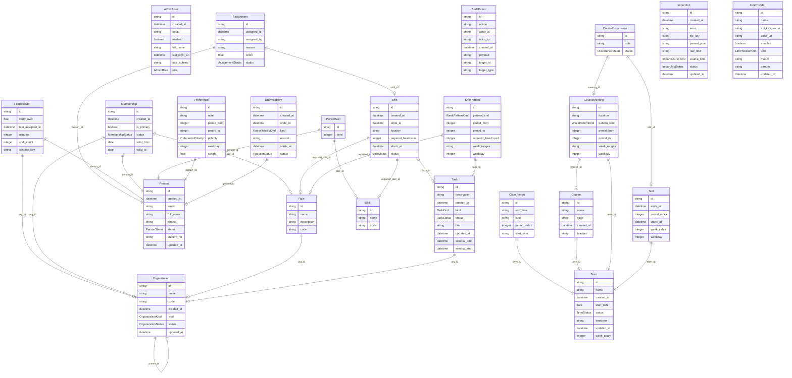

```mermaid
erDiagram
AdminUser {
    string id  
    datetime created_at  
    string email  
    boolean enabled  
    string full_name  
    datetime last_login_at  
    string oidc_subject  
    AdminRole role  
}
Assignment {
    string id  
    datetime assigned_at  
    string assigned_by  
    string reason  
    float score  
    AssignmentStatus status  
}
AuditEvent {
    string id  
    string action  
    string actor_id  
    string actor_ip  
    datetime created_at  
    string payload  
    string target_id  
    string target_type  
}
ClassPeriod {
    string id  
    string end_time  
    string label  
    integer period_index  
    string start_time  
}
Course {
    string id  
    string name  
    string code  
    datetime created_at  
    string teacher  
}
CourseMeeting {
    string id  
    string location  
    WeekPatternKind pattern_kind  
    integer period_from  
    integer period_to  
    string week_ranges  
    integer weekday  
}
CourseOccurrence {
    string id  
    string note  
    OccurrenceStatus status  
}
FairnessStat {
    string id  
    float carry_over  
    datetime last_assigned_at  
    integer minutes  
    integer shift_count  
    string window_key  
}
ImportJob {
    string id  
    datetime created_at  
    string error  
    string file_key  
    string parsed_json  
    string raw_text  
    ImportSourceKind source_kind  
    ImportJobStatus status  
    datetime updated_at  
}
LlmProvider {
    string id  
    string name  
    string api_key_secret  
    string base_url  
    boolean enabled  
    LlmProviderKind kind  
    string model  
    string params  
    datetime updated_at  
}
Membership {
    string id  
    datetime created_at  
    boolean is_primary  
    MembershipStatus status  
    date valid_from  
    date valid_to  
}
Organization {
    string id  
    string name  
    string code  
    datetime created_at  
    OrganizationKind kind  
    OrganizationStatus status  
    datetime updated_at  
}
Person {
    string id  
    datetime created_at  
    string email  
    string full_name  
    string phone  
    PersonStatus status  
    string student_no  
    datetime updated_at  
}
PersonSkill {
    string id  
    integer level  
}
Preference {
    string id  
    string note  
    integer period_from  
    integer period_to  
    PreferencePolarity polarity  
    integer weekday  
    float weight  
}
Role {
    string id  
    string name  
    string description  
    string code  
}
Shift {
    string id  
    datetime created_at  
    datetime ends_at  
    string location  
    integer required_headcount  
    datetime starts_at  
    ShiftStatus status  
}
ShiftPattern {
    string id  
    WeekPatternKind pattern_kind  
    integer period_from  
    integer period_to  
    integer required_headcount  
    string week_ranges  
    integer weekday  
}
Skill {
    string id  
    string name  
    string code  
}
Slot {
    string id  
    datetime ends_at  
    integer period_index  
    datetime starts_at  
    integer week_index  
    integer weekday  
}
Task {
    string id  
    string description  
    datetime created_at  
    TaskKind kind  
    TaskStatus status  
    string title  
    datetime updated_at  
    datetime window_end  
    datetime window_start  
}
Term {
    string id  
    string name  
    datetime created_at  
    date start_date  
    TermStatus status  
    string timezone  
    datetime updated_at  
    integer week_count  
}
Unavailability {
    string id  
    datetime created_at  
    datetime ends_at  
    UnavailabilityKind kind  
    string reason  
    datetime starts_at  
    RequestStatus status  
}

Assignment ||--|o Shift : "shift_id"
Assignment ||--|| Person : "person_id"
ClassPeriod ||--|| Term : "term_id"
Course ||--|| Term : "term_id"
CourseMeeting ||--|o Course : "course_id"
CourseMeeting ||--|| Term : "term_id"
CourseOccurrence ||--|o CourseMeeting : "meeting_id"
CourseOccurrence ||--|o Slot : "slot_id"
FairnessStat ||--|o Organization : "org_id"
FairnessStat ||--|| Person : "person_id"
Membership ||--|o Organization : "org_id"
Membership ||--|o Role : "role_id"
Membership ||--|| Person : "person_id"
Organization ||--|o Organization : "parent_id"
PersonSkill ||--|o Skill : "skill_id"
PersonSkill ||--|| Person : "person_id"
Preference ||--|| Person : "person_id"
Role ||--|o Organization : "org_id"
Shift ||--|o Role : "required_role_id"
Shift ||--|o Skill : "required_skill_id"
Shift ||--|o Task : "task_id"
ShiftPattern ||--|o Role : "required_role_id"
ShiftPattern ||--|o Task : "task_id"
Slot ||--|| Term : "term_id"
Task ||--|o Organization : "org_id"
Unavailability ||--|| Person : "person_id"

```

